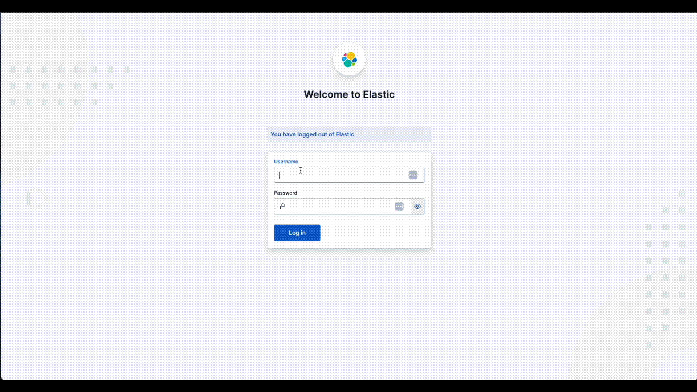
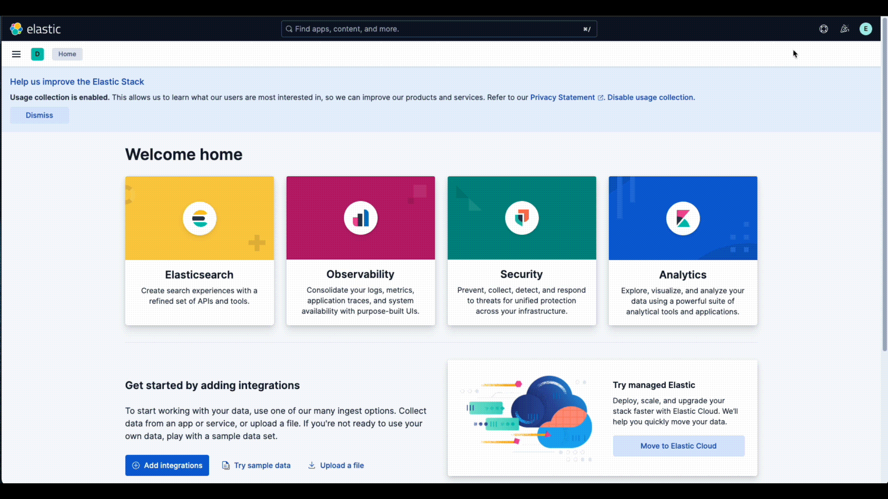
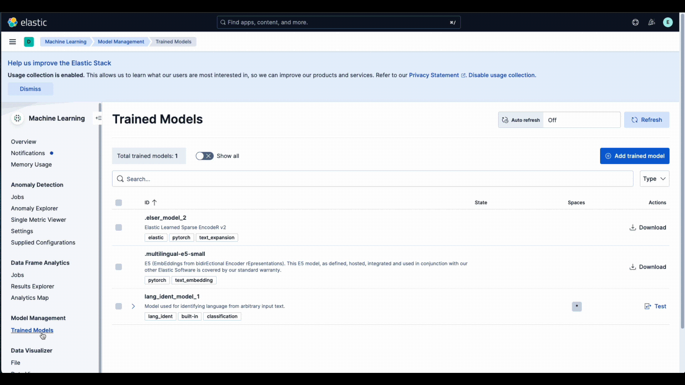

# Installing Elasticsearch and Kibana with Docker

Quickly set up Elasticsearch and Kibana in Docker for local development or testing using this one-liner in the command line.

This setup comes with a one-month trial license that includes all Elastic features.

## Prerequisites

1. **Install Docker**  
  If you don’t have Docker installed, download and install [Docker Desktop](https://www.docker.com/products/docker-desktop/) for your operating system.

2. **(Windows only) Install WSL**  
  If you’re using Microsoft Windows, install [Windows Subsystem for Linux (WSL)](https://docs.microsoft.com/en-us/windows/wsl/install).
<br><br>
## Step 1: Run the start-local Script

Navigate into the` elastic-start-local` folder from the root directoy and enter the following command to start the docker image:

```bash
cd elastic-start-local
docker compose up -d
```

This will start your own local instance of Elasticsearch and Kibana. After running the script, you can access the Elastic services at:

- **Elasticsearch:** [http://localhost:9200](http://localhost:9200)
- **Kibana:** [http://localhost:5601](http://localhost:5601)

To find your local API key and login password, open your .env inside the `elastic-start-local` folder. They will be different for everyone. 

You'll want to take note of these two pieces of information:
```bash
ES_LOCAL_PASSWORD=<YOUR-UNIQUE-PASSWORD>
ES_LOCAL_API_KEY=<YOUR-UNIQUE-API-KEY>
```

You'll need these to connect your code to your Elasticsearch instace.
<br><br>
## Step 2: Test Your Elasticsearch Connection

You can verify that your local Elasticsearch instance is running by sending a simple request using `curl`. Replace `T54gI25g` with your actual password from the `.env` file:

```bash
curl -u elastic:T54gI25g http://localhost:9200
```

If everything is working, you should see a JSON response with cluster information:

```json
{
  "name" : "0f1288403cf4",
  "cluster_name" : "docker-cluster",
  "cluster_uuid" : "OMO2xLAURlOKlKZqzUemkQ",
  "version" : {
    "number" : "9.0.1",
    "build_flavor" : "default",
    "build_type" : "docker",
    "build_hash" : "73f7594ea00db50aa7e941e151a5b3985f01e364",
    "build_date" : "2025-04-30T10:07:41.393025990Z",
    "build_snapshot" : false,
    "lucene_version" : "10.1.0",
    "minimum_wire_compatibility_version" : "8.18.0",
    "minimum_index_compatibility_version" : "8.0.0"
  },
  "tagline" : "You Know, for Search"
}
```
<br><br>
## Step 3: Download and Deploy your embedding model

Now we'll want to load the embedding model necessary to run semantic search into our Elasticsearch instance. 

<br>
<details>
  <summary>1. Navigate to <a href="http://localhost:5601" target="new">http://localhost:5601</a> and log in with your local <code>.env</code> credentials:
  <br><code>
  username: elastic<br>
  password: {ES_LOCAL_PASSWORD}<br>
  </code>
  </summary>
  
</details>
<br>


<details>
  <summary>2. Click on the triple line (hamburger) icon on the top left of the site to reach the main menu. Navigate to Machine Learning, then to Trained Models</summary>
  
</details>
<br>
<details>
  <summary>3. To the right of the .multilingual-e5-small row, click the Download link.
</summary>
  
</details>

<br>

<details>
  <summary>4. Click deploy when available. Choose Search optimization and then click Start
</summary>
  
</details>

<br>

5. Your embedding model is now ready for use!
